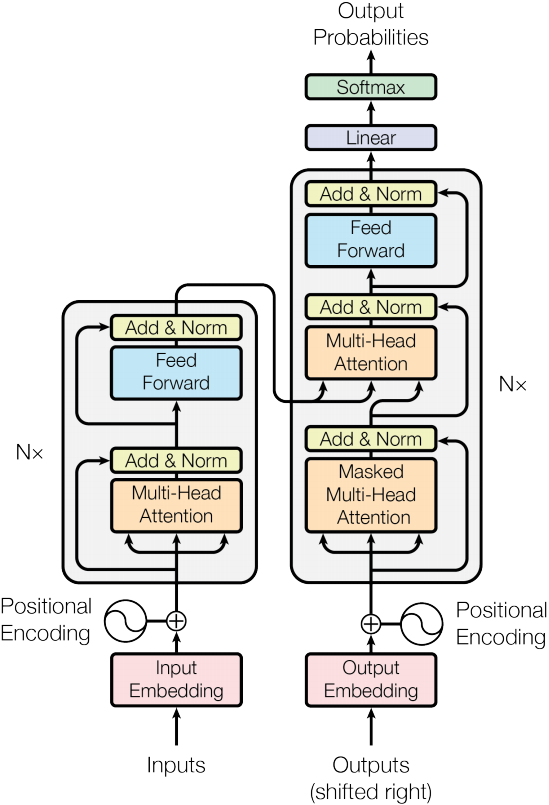

# transformer_for_textclassification

## Transformer Architecture

## Fine-tune Tricks
The demo apply transformer decoder to finish text classification task. Actually, it's hard to adjust the parameter value of model to proper one. Here, I draw a brief conclusion for how to effectively fine-tune the parameters.

+ Adam optimization with learning rate of 1.5e-4 (1e-4 magnitude) and learning rate decay schedule with exponential decay of each epoch. If lr is set larger(1e-3 magnitude), the result is not well.

+ For activation function, GeLU seems works worse than ReLU (maybe due to limited corpus).

+ For regularization, dropout with a rate of 0.1 (but not in interval 0.2 to 0.5) and label smoothing for better generalization.

+ x + dropout(sublayer(norm(x))) give a better result than norm(x + dropout(sublayer(x)))

+ For the position-wise feed-foward network, you can set the inner state dimensionality larger. (1024 d_ff for 300 d_model)

+ For multi-head self-attention network, more heads, better performance. 
